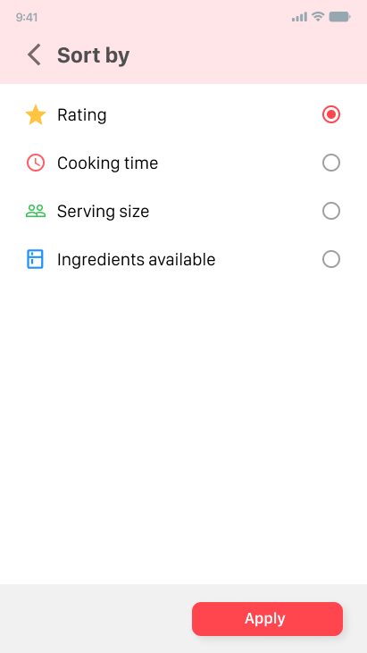
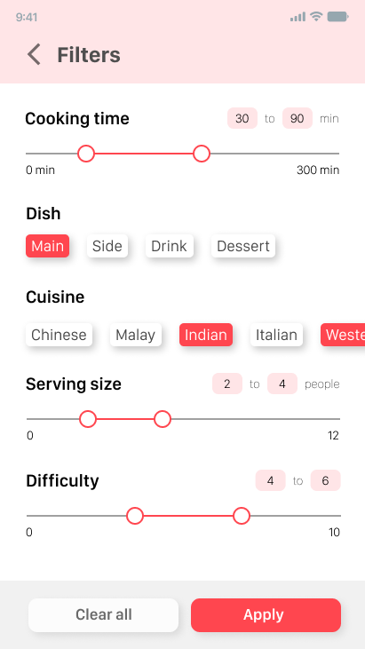
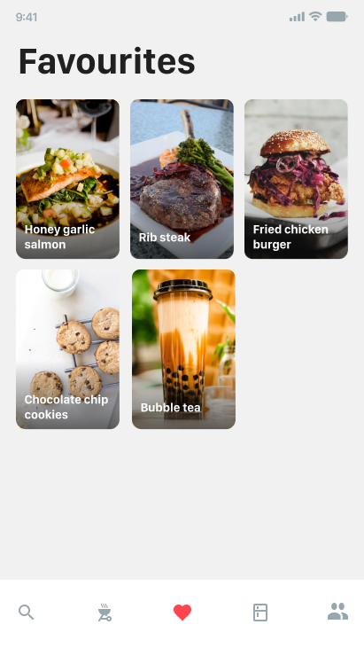
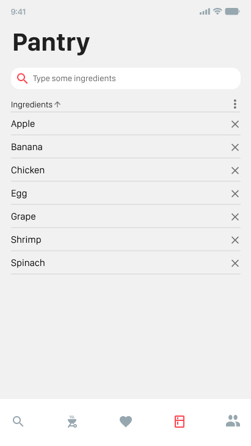

### UI design and Prototype done in Figma ###

  
     &nbsp;&nbsp;&nbsp;&nbsp;&nbsp;
     &nbsp;&nbsp;&nbsp;&nbsp;&nbsp;
     &nbsp;&nbsp;&nbsp;&nbsp;&nbsp;
  

 

  
     &nbsp;&nbsp;&nbsp;&nbsp;&nbsp;
     &nbsp;&nbsp;&nbsp;&nbsp;&nbsp;
     &nbsp;&nbsp;&nbsp;&nbsp;&nbsp;
  

 

  
     &nbsp;&nbsp;&nbsp;&nbsp;&nbsp;
     &nbsp;&nbsp;&nbsp;&nbsp;&nbsp;
     &nbsp;&nbsp;&nbsp;&nbsp;&nbsp;
   

  
     &nbsp;&nbsp;&nbsp;&nbsp;&nbsp;
   

